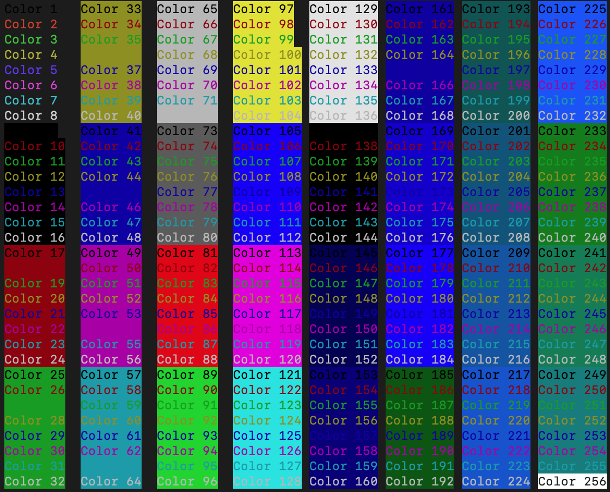

# Colors

Color text in curses is usually done via a `color_pairs` method. With Dashport, color pairs (foreground and background) are defined with a single integer which sets both backgrounnd and foreground.

Set the `color_default` value when starting a Dashport object to set the default text color value. Setting the color_default to `None` will set the default color to the default colors of the terminal session.

The `background` method will fill the background with the background for the `color` selected. It does this by setting down a space character in every text position. It's best to use background before any other printing commands.

Use the `rectangle` method to draw a rectangle. It's best to keep rectangles away from the edges or corners of the screen, or filling up the entire screen. Use `background` to fill the screen with a color, or insstr to insert a string into the corner.

```
from dashport.dash import Dashport, Info
from dashport.run import wrap

def info(stdscr):
    return Info(stdscr)

def dashport(stdscr):
    app = Dashport(stdscr, color_default=8)
    app.print("this text won't show", color=3)
    app.background(color=18)
    app.print("some color text", x=20, color=3)
    app.rectangle(10, 10, 12, 12, color=98)
    while True:
        app.refresh()


if __name__ == '__main__':
    wrap(dashport, info)
```

Use this table to find the color scheme appropriate for your app:




# Formatting text

The `print` function can take various attributes to change the text. These text attributes are available in the [Python curses documentation](https://docs.python.org/3/library/curses.html#curses.ncurses_version). Use the constants listed in the table to change the text. In the example below, `A_BOLD` is set, which boldens the text. Please note, that support for these attributes is very system-dependent, and some attributes may not be available on all systems. Any unavailable text formatting will be ignored by Dashport, rather than crash the program.

```
from dashport.dash import Dashport, Info
from dashport.run import wrap

def info(stdscr):
    return Info(stdscr)

def dashport(stdscr):
    app = Dashport(stdscr, color_default=8)
    app.print("This text is bold.", A_BOLD=True)
    app.print("This text is italic.", A_ITALIC=True)
    while True:
        app.refresh()


if __name__ == '__main__':
    wrap(dashport, info)
```
