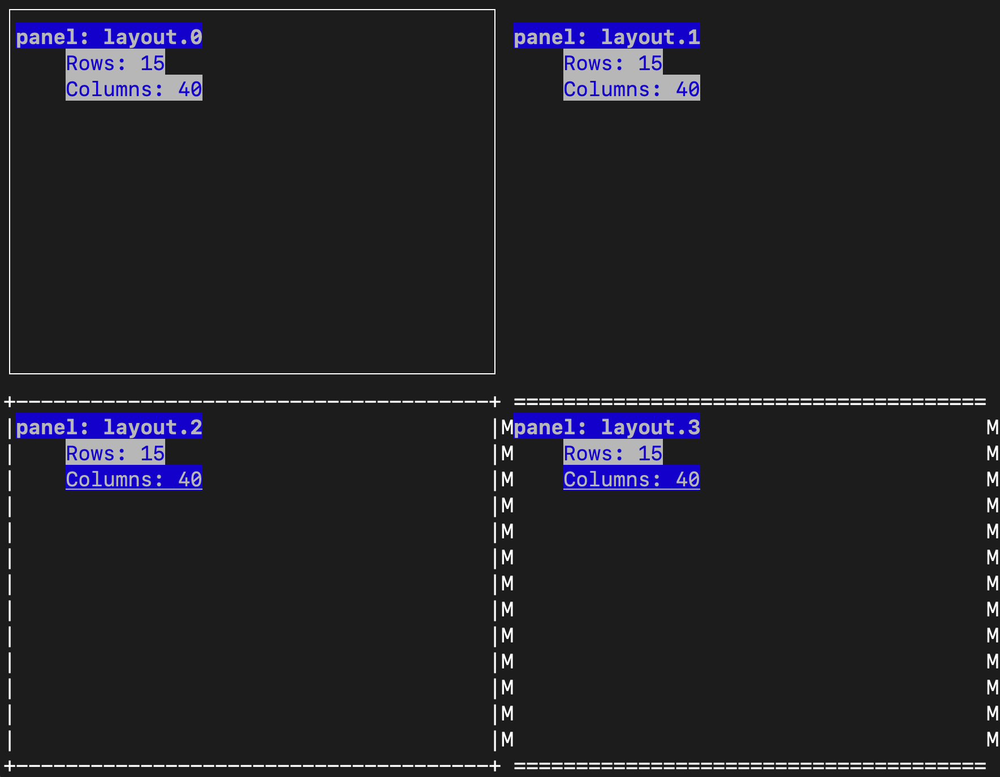

# Layouts

These examples show the different layouts that can be implemented through Dashport.

## split_screen_columns

## split_screen_rows

## quadrants

## three_panels_horizontal

## three_panels_vertical

